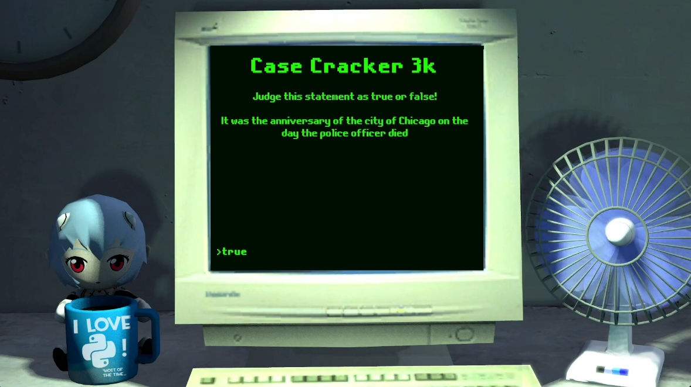

# Turing's Case
**Game developed for the Computer Science Course at PUC-PR.**

## Project Introduction(Portuguese): https://www.youtube.com/watch?v=VmZKDKjc4X0
## The Project  
Our assignment was to build a simple terminal game where players would use induction and boolean logic to solve a case. However, I decided to create something fancier. I hope you enjoy it!

<p align="center">



</p>

## "Unorthodox Code" comment
This project was developed in a single crunch session; I had about a day and a half to complete both the graphics and the code, that is essentially what it is saying.

# Project Setup Instructions

## Prerequisites

To run this project, you will need to install **Unity 2022.3.5f1**. Follow the steps below to install the correct version and set up the project:

### 1. Install Unity Hub

1. Download and install **Unity Hub** from [here](https://unity.com/download).
2. Open Unity Hub after installation.

### 2. Install Unity 2022.3.5f1

1. In Unity Hub, go to the **Installs** tab.
2. Click on the **Install Editor** button.
3. Select **2021.3.39f** from the list of available versions. If it’s not listed:
   - Click **Archive**, which will redirect you to the Unity download archive.
   - Scroll down and find **2022.3.5f1**.
   - Click **Download Archive**, and use Unity Hub to install it.

### 3. Clone the Repository

1. Clone the project repository to your local machine:
   ```git@github.com:romm27/turings-case.git```
2. Open Unity Hub and go to the **Projects** tab.
3. Click **Add**, then navigate to the folder where the project was cloned, and select it.

### 4. Open the Project

1. Select the project in Unity Hub.
2. Ensure **Unity 2021.3.39f** is selected as the version.
3. Click **Open** to launch the project in Unity.

---

You're all set!
